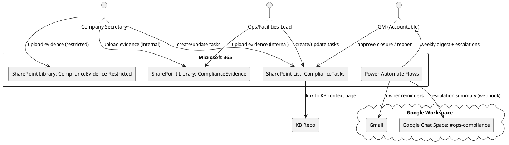

# SPEC-001A-Compliance-and-Evidence

## Background

SPEC-001A is the first execution track under the SPEC-001 umbrella.

It exists to eliminate high-severity legal and operational compliance risks by establishing a single, governed workflow for:

- Tracking compliance obligations (e.g., Companies House filings, PSC register correctness).
- Capturing and storing evidence artifacts (PDFs, confirmations, contracts, certificates).
- Enforcing ownership, due dates, escalation, and sign-off.

This track intentionally delivers value *without* waiting for POS/inventory data hygiene or automation work.

## Requirements

### Must

- **Single source of truth for compliance tasks**
  - Implement a governed register of compliance obligations with explicit owners, due dates, status, and evidence links.
  - GM is the accountable approver for the overall system; domain owners remain responsible for producing evidence artifacts.

- **Close urgent Companies House risks**
  - Motorino London Ltd: Confirmation Statement (CS01) tracked to closure.
  - Town London Ltd: PSC register anomaly tracked to closure.

- **PPM / facilities evidence capture**
  - Capture HVAC PPM agreement status for Chapman Ventilation (contract, renewal date, service scope).
  - Capture landlord interfaces / plant notes evidence where relevant (e.g., warranties, defects-liability context).
  - **PPM Contract Renewal Workflow:**
    - Set `next_review_due` = contract_end_date - 90 days
    - Trigger reminder flow at 90/60/30 days before expiry
    - Escalate to GM if no renewal evidence by 14 days before expiry

- **Evidence-first closure rule**
  - A task cannot be moved to "Closed" without an evidence artifact attached or linked (e.g., filed confirmation, signed contract, certificate).

- **Security & privacy controls**
  - Restrict access to tasks and evidence that contain personal data (e.g., contact numbers, director identifiers).
  - Maintain a clear sensitivity model: internal vs restricted.

### Should

- Track H&S and certification expiries (first aid, fire marshal, etc.) with reminders.
- Provide a monthly compliance pack export (PDF/Excel snapshot) for record keeping.

### Could

- Add a lightweight "policy as code" check: flags if a task is overdue beyond a threshold and requires GM acknowledgement.

### Won't (in 001A)

- Automate filings or modify Companies House records programmatically.
- Replace professional legal/accounting advice.

## Method

### Architecture

- **SharePoint is the system of record** for compliance tasks and evidence.
- **SharePoint List**: ComplianceTasks (structured register).
- **SharePoint Document Libraries**:
  - **ComplianceEvidence** (internal): non-sensitive evidence (contracts, certificates, non-PII documents).
  - **ComplianceEvidence-Restricted** (restricted): sensitive evidence (director IDs, unredacted contracts, anything containing personal data). ACL is set at the library level to avoid brittle item-level permissions.
- **Power Automate**: reminders, escalations, and weekly/monthly digests.
- **KB linkage**: each critical obligation has a short KB page (internal or restricted) that explains context, process, and where evidence lives.

### Data model

#### SharePoint List: ComplianceTasks

| Field | Type | Notes |
|---|---|---|
| task_id | Single line text | Format: CT-YYYY-NNN (generated) |
| entity | Choice | Town London Ltd / Motorino London Ltd / Site (Drury Lane/Pearson Sq) |
| task_type | Choice | CS01, PSC, Accounts, ID Verification, PPM Contract, Certificate, Landlord, Other |
| severity | Choice | Critical / High / Medium / Low |
| title | Single line text | Human-readable |
| description | Multiple lines | What and why |
| owner | Person/Group | Responsible owner |
| accountable | Person/Group | Defaults to GM |
| due_date | Date | Single due date |
| status | Choice | Open / In Progress / Blocked / Awaiting Evidence / Closed |
| evidence_required | Yes/No | Default Yes |
| evidence_link | Hyperlink | Link to file/folder in **ComplianceEvidence** or **ComplianceEvidence-Restricted** |
| kb_link | Hyperlink | Link to KB context page |
| last_notified_at | DateTime | Used by flows |
| escalation_level | Number | 0/1/2 |
| closed_at | DateTime | When closed |
| closed_by | Person | Approver |
| notes | Multiple lines | Audit notes |

#### SharePoint Library: ComplianceEvidence

- Folder structure:
  - `/ComplianceEvidence/<entity>/<task_id>/...`
  - `/ComplianceEvidence-Restricted/<entity>/<task_id>/...`
- Metadata columns:
  - task_id (lookup/text), entity (choice), task_type (choice), sensitivity (internal/restricted), expiry_date (optional), vendor (optional)

### Workflows

#### 1) Daily reminder and escalation

- Runs every weekday morning.
- Query ComplianceTasks where:
  - status != Closed AND due_date <= (today + 14 days)
- Send reminder to owner (email).
- If overdue:
  - **Overdue calculation:** `overdueDays = today - due_date` (calendar days past due)
  - **Example:** Task due 2026-02-15, today 2026-02-19 → overdueDays = 4
  - escalation_level 0 → 1 after 3 days overdue
  - escalation_level 1 → 2 after 7 days overdue
  - escalation_level 2 triggers GM escalation email and requires "Acknowledged by GM" comment.

- **Chat escalation (summary-only):**
  - When escalation_level becomes 1 or 2, post a message to `#ops-compliance` via an **Incoming Webhook**.
  - Recommended threading: append `threadKey=<task_id>` to the webhook URL so each task stays in a single thread.
  - Message template:
    - `⚠️ OVERDUE: <title> (Owner: <owner>). <n> days overdue. Evidence: <missing/present>`

#### 2) Weekly GM digest

- Summary of:
  - All Critical/High tasks
  - Overdue tasks
  - Tasks closing soon (next 14 days)
  - Newly created tasks

#### 3) Closure gate

- When status changes to Closed:
  - Validate evidence_link present (or evidence_required = No).
  - Validate closed_by is GM (or delegated approver group).
  - If validation fails, revert status to Awaiting Evidence and notify owner.

#### 4) PPM Contract Renewal Reminders

- Runs daily for tasks where task_type = "PPM Contract"
- Triggers reminders at:
  - 90 days before contract expiry
  - 60 days before contract expiry
  - 30 days before contract expiry
  - 14 days before expiry: escalate to GM if no renewal evidence uploaded

## Implementation

1) **SharePoint setup**
   - Create a dedicated SharePoint site: `SecondBrain`.
   - Create ComplianceTasks list + **ComplianceEvidence** library + **ComplianceEvidence-Restricted** library.
   - Configure permissions:
  - GM: Full control.
  - Company Secretary / Finance: Edit.
  - Facilities/Ops: Edit (site-specific).
  - Managers: Read-only.
  - **ComplianceEvidence-Restricted:** only GM + Company Secretary + Finance Lead (library-level ACL).

2) **Power Automate flows**
   - Daily reminders + escalations (email).
   - Weekly GM digest.
   - Closure gate (status-change validation).
   - PPM Contract renewal reminders.
   - **Escalation visibility (Chat):** if a task hits `escalation_level >= 1`, post a *summary-only* message to the private Google Chat space `#ops-compliance` (no attachments).

3) **KB integration**
   - Add KB pages:
     - "Companies House Compliance Runbook" (internal/restricted)
     - "Motorino CS01 — Evidence & Timeline" (restricted)
     - "Town PSC anomaly — Evidence & Timeline" (restricted)
     - "HVAC PPM — Chapman Ventilation" (internal/restricted)

4) **Operational ritual**
   - 15-minute weekly review (GM + owners) using ComplianceTasks view.
   - Monthly compliance snapshot export + file to ComplianceEvidence.

## Milestones

- **M1 (Day 1–2):** SharePoint site + list/library created; permissions set.
- **M2 (Day 3–5):** Power Automate reminder + GM digest flows live.
- **M3 (Week 2):** Closure gate live; urgent CS01 + PSC tasks tracked; evidence folder structure populated.
- **M4 (Week 3–4):** PPM contract workflow + certification expiry tracking operational; PPM renewal reminders tested; monthly export process defined.

## Gathering Results

- **Risk reduction:** 0 Critical overdue tasks for >7 days.
- **Evidence completeness:** 100% of Closed tasks have evidence_link (unless explicitly waived).
- **Operational adoption:** Weekly review occurs; owners update tasks without admin friction.
- **Audit readiness:** Monthly snapshot pack available and searchable.
- **PPM continuity:** Contract renewals tracked proactively; 0 lapses due to missed renewal dates.

## Need Professional Help in Developing Your Architecture?

Please contact me at [sammuti.com](https://sammuti.com) :)