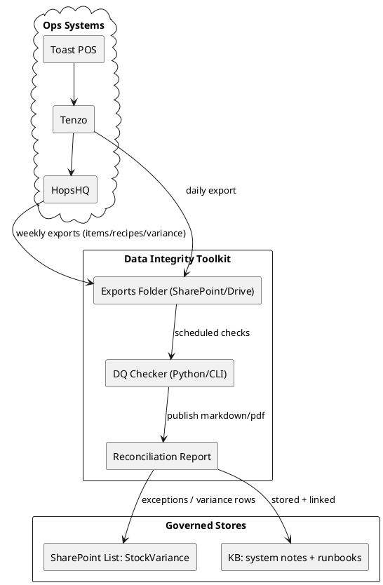

# SPEC-001B-Data-Integrity-Toast-Tenzo-HopsHQ

## Background

SPEC-001B stabilises the revenue-to-inventory "truth chain" so GP, variance, and waste signals are trustworthy.

The live operational flow is:

**Toast POS → Tenzo (sales passthrough) → HopsHQ (theoretical usage + stock + COGS)**

If PLUs, recipes, and units-of-measure drift, then:

- Daily KPIs stop matching stock variance.
- Managers lose trust and revert to manual work.
- Automation and AI workflows produce confident-but-wrong outputs.

## Requirements

### Must

- **Define and enforce data-quality gates ("trust gates")**
  - PLU mapping coverage = 100% for active menu items (at least for the top revenue set).
  - Recipe linkage rate ≥ 95% for revenue-generating items.
  - UoM conflict count = 0 (weekly scan).
  - Sync success rate ≥ 99.5% (or an explicit, monitored SLA).

- **72-hour stabilisation playbook (repeatable)**
  - Day 1: PLU integrity audit + reconciliation report.
  - Day 2: Recipe linkage + UoM alignment + top-20 Pareto fixes.
  - Day 3: Baseline stock count + variance baselining + cadence published.

- **Create an operational runbook**
  - "What to do when a new PLU is added"
  - "What to do when recipes change"
  - "What to do when sync fails / lags"
  - "How to validate data before reporting"

- **Produce a reconciliation report artifact**
  - A versioned, stored report that lists:
    - unmapped Toast PLUs
    - orphan HopsHQ items
    - duplicate mappings
    - UoM conversion gaps

### Should

- Automate variance ingestion into SharePoint StockVariance for triage.
- Establish a weekly variance investigation workflow with owners and closure targets.
- Implement a 7-day parallel run to prove theoretical vs actual targets.

### Could

- Build lightweight data observability: weekly DQ dashboard + anomaly detection.

### Won't (in 001B)

- Replace Tenzo or HopsHQ.
- Build a bespoke data warehouse.

## Method

### Architecture

### Data contracts (exports)

Minimum MVP exports (CSV):

- `toast-plu-export-YYYY-MM-DD.csv` (PLU, name, price, active, modifiers)
- `tenzo-sales-export-YYYY-MM-DD.csv` (PLU, qty, net sales, venue, date)
- `hopshq-items-export-YYYY-MM-DD.csv` (item_id, name, uom, category, active)
- `hopshq-recipes-export-YYYY-MM-DD.csv` (plu, recipe_id, ingredients, quantities, uom)
- `hopshq-variance-export-YYYY-MM-DD.csv` (item, theoretical, actual, variance, value)

### Core algorithm: reconciliation

1) Normalise keys
   - trim whitespace, case-normalise, remove hidden unicode, unify separators.
2) PLU coverage
   - active_toast_minus_mapped = active Toast PLUs not present in HopsHQ recipe map.
3) Orphans
   - hops_items_without_recipe = active HopsHQ items never referenced in any recipe.
4) Duplicate mapping
   - same PLU mapping to multiple recipes OR multiple PLUs mapping to same recipe unexpectedly.
5) UoM conversion validation
   - require explicit conversion for any cross-uom recipe line.

### Operational process (how this becomes "boring and reliable")

- **Change control**
  - New PLUs / recipe changes must create a DataIntegrity task (simple checklist).

- **Cadence (decision)**
  - **Weekly full stock count:** **Sunday 22:00–23:30** (post-service) for **both Town and Motorino**
    - End-of-week snapshot aligned to Monday morning management/P&L review
    - Must be completed before Monday 06:00 automation run
    - Allows overnight variance reconciliation
  - **Daily high-value spot checks:** mandate on high-value/high-shrink lines (e.g., premium beef, premium wines) to catch leakage before Sunday.
  - **Fortnightly** PLU mapping review.
  - **Monthly** recipe audit sample.

## Implementation

1) Define the export mechanism (Tenzo scheduled export + HopsHQ exports).
2) Create a governed exports folder in **SharePoint** with retention rules.
   - Compromise: automatically post the latest Reconciliation Report link to Google Chat `#daily-ops` every Monday morning (via SPEC-001C).
3) Implement DQ Checker:
   - Start as a Python script or contractor-owned CLI.
   - Inputs: the export CSVs.
   - Outputs: reconciliation report + exception CSVs.
4) Publish reconciliation report to KB + link from a "Toast↔HopsHQ Integration Notes" page.
5) Create SharePoint StockVariance ingestion (manual upload first; automate later).
6) Run 72-hour stabilisation playbook and publish results.
7) Run 7-day parallel trust proof; decide if "system trusted".

## Milestones

- **B1 (Day 1):** Export formats agreed; first exports captured.
- **B2 (Days 2–3):** Reconciliation report v1 produced; top-20 fixes applied.
- **B3 (Week 1):** Baseline stock count completed; cadence published; variance report reviewed.
- **B4 (Weeks 2–4):** Automated variance ingestion + weekly triage workflow.
- **B5 (Week 4+):** 7-day parallel run meets targets; declare trusted.

## Gathering Results

- PLU mapping coverage: 100% (or 100% for top revenue set, with a clear backlog for the rest).
- Recipe linkage rate: ≥95% for revenue-generating items.
- UoM conflict count: 0.
- Theoretical vs actual variance targets met on food/bev.
- Managers report that GP/variance signals are "trusted enough to act on".

## Need Professional Help in Developing Your Architecture?

Please contact me at [sammuti.com](https://sammuti.com) :)